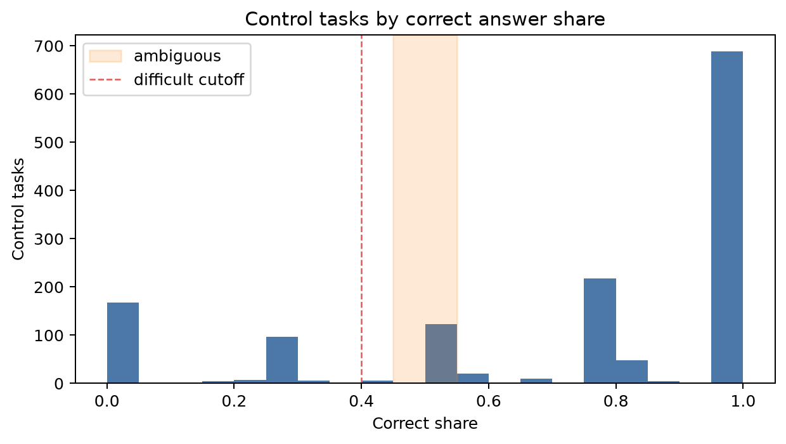

# Отчёт по проекту

Цель работы — привести лог краудсорсингового проекта к удобному для анализа виду, найти проблемные контрольные задания и посчитать несколько метрик, по которым можно оценить состояние проекта.

В исходном ТЗ разметка описана как бинарная (`yes`/`no`), но в данных есть третий ответ `not_working`. Я не удалял его и считал как отдельный валидный вариант ответа, потому что это важный сигнал: часть сайтов может быть недоступна или не открываться у исполнителя.

## Ключевые определения

| Термин | Что означает в отчёте |
|---|---|
| `assignment` | страница/пачка заданий, которую получил исполнитель |
| `item` | один URL внутри assignment |
| контрольное задание | item, у которого в `task_suite_raw_tasks` заполнено `known_solutions` |
| `gold_answer` | правильный ответ из `known_solutions` |
| `worker_answer` | ответ исполнителя: `yes`, `no` или `not_working` |
| `share` | доля: числитель / знаменатель, например `correct_share = n_correct / n_valid_votes` |

## Задание 1. Привести данные к удобному формату

Что было сделано: JSON-строки с заданиями и ответами раскрыты в табличный формат. Главная таблица теперь устроена так: одна строка = один URL внутри одного assignment. Это удобно для просмотра, фильтрации, построения графиков и расчёта метрик.

Полученный рабочий слой:

| Таблица | Что означает | Для чего нужна |
|---|---|---|
| `dataset/items_long.csv` | детальная таблица item-уровня: assignment, worker, URL, ответ, контроль/не контроль, правильность на контроле | основная таблица для всех расчётов |
| `dataset/assignments.csv` | одна строка = один assignment; хранит статус, время, число заданий и контрольную точность по отвеченным контролям внутри страницы | оценка выполнения страниц и статусов |
| `dataset/workers_quality.csv` | одна строка = один исполнитель; хранит объём работы, число контролей, точность и распределение ответов | первичная оценка качества исполнителей |
| `dataset/url_quality.csv` | одна строка = один URL; хранит число показов, голоса `yes/no/not_working`, итоговый majority-label и согласованность | просмотр спорных URL и агрегирование обычных заданий |

 `url_quality`: это показатель согласованности голосов. Например, `confidence = max(yes_count, no_count, not_working_count) / shown_count`, а `disagreement_score = 1 - confidence`. Если голоса разделились поровну, `final_label = tie`.

Что получилось: в данных 21 437 ассайнментов, 203 963 item-строк и 2 258 исполнителей. По статусам: APPROVED = 18 579, EXPIRED = 2 815, SKIPPED = 43.

В `assignments.csv` поле `control_accuracy` считается как `control_correct_count / control_answered_count`. Для страниц без ответов на контроли значение оставлено пустым, потому что качество по ним нельзя оценить.

Вывод по заданию 1: данные стали пригодны для анализа. Основная таблица `items_long` остаётся полной и пересчитываемой, а остальные таблицы являются компактными агрегатами для быстрого просмотра.

## Задание 2. Найти сложные и неоднозначные контрольные задания

Из `items_long` взяты только APPROVED-ответы по контрольным заданиям. Контроль определяется по непустому `known_solutions`. 

Если один и тот же исполнитель встретил один контроль повторно и дал разные ответы, такой голос считается конфликтным и не попадает в `correct_share`/`incorrect_share`. В этих данных таких конфликтных контролей нет. Если пользователь получает одно и то же задание несколько раз и даёт один и тот же ответ, строка дедублицируется.

Правила классификации:

| Тип | Условие | Что означает |
|---|---|---|
| `eligible_by_n` | `n_valid_votes >= 4` | контроль имеет достаточное число независимых голосов, чтобы по нему делать вывод |
| `difficult` | `eligible_by_n` и `incorrect_share >= 0.60` | большинство исполнителей ошибается; контроль может быть сложным или иметь неверный gold |
| `ambiguous` | `eligible_by_n` и `correct_share` от `0.45` до `0.55` | исполнители делятся почти пополам; формулировка/сайт может быть неоднозначной |

Как читать таблицы этого этапа:

| Таблица | Что означает |
|---|---|
| `control_task_metrics/worker_control_votes.csv` | промежуточный аудит: один исполнитель × один контроль; нужен, чтобы проверить повторы и конфликты |
| `control_task_metrics/control_task_metrics.csv` | все контрольные задания со всеми рассчитанными долями и флагами |
| `control_task_metrics/problem_controls.csv` | только итоговый список контролей, которые попали в `difficult` или `ambiguous` |

Основные поля в `problem_controls.csv`:

| Поле | Смысл |
|---|---|
| `url` | URL контрольного задания |
| `gold_answer` | правильный ответ по `known_solutions` |
| `n_valid_votes` | число валидных worker-control голосов |
| `correct_share` | доля правильных ответов |
| `incorrect_share` | доля неправильных ответов |
| `flag` | причина попадания в проблемные: `difficult`, `ambiguous` или оба признака |

Что получилось: из 12 698 уникальных контролей 1 405 имеют достаточно голосов (`n>=4`). Среди них 289 сложных, 123 неоднозначных, всего проблемных контролей 412. Общая точность по всем валидным worker-control голосам: 71.9%.

График ниже показывает распределение `correct_share` по контролям с достаточным числом голосов. Левая часть графика — контроли, на которых часто ошибаются; зона около `0.5` — неоднозначные контроли; правая часть — стабильные контроли, где большинство отвечает правильно.



Топ проблемных контролей:

| url | gold_answer | n_valid_votes | correct_share | incorrect_share | flag |
| --- | --- | --- | --- | --- | --- |
| https://gazballon-nizhniy-tagil.ru | no | 8 | 0.000 | 1.000 | difficult |
| https://efsmoscow.ru | no | 7 | 0.000 | 1.000 | difficult |
| https://cheese-box.ru | yes | 6 | 0.000 | 1.000 | difficult |
| https://faridkamal.pro | not_working | 6 | 0.000 | 1.000 | difficult |
| https://filternn.ru | no | 6 | 0.000 | 1.000 | difficult |
| https://food-service.ru | yes | 6 | 0.000 | 1.000 | difficult |
| https://grocenberg.store | no | 6 | 0.000 | 1.000 | difficult |
| https://ishop72.ru | no | 6 | 0.000 | 1.000 | difficult |
| https://les-wm.ru | no | 6 | 0.000 | 1.000 | difficult |
| https://m-open.ru | no | 6 | 0.000 | 1.000 | difficult |
| https://myshop-bei517.myinsales.ru | not_working | 6 | 0.000 | 1.000 | difficult |
| https://orbitansk.ru | no | 6 | 0.000 | 1.000 | difficult |

Вывод по заданию 2: почти треть контролей с достаточным числом голосов попадает в группу проблемных. Эти контроли стоит вручную пересмотреть: у части может быть неверный `gold_answer`, часть может быть объективно сложной или плохо сформулированной.

## Задание 3. Посчитать дополнительные метрики проекта

Что было сделано: посчитаны 5 метрик, которые покрывают операционное состояние, качество разметки, качество контрольного пула и риск по исполнителям.

В качестве обязательной метрики качества проекта выбрана `control_accuracy`: она показывает долю правильных ответов исполнителей на контрольных заданиях.

| Метрика | Как считается | Значение | Что означает и какой вывод даёт |
|---|---|---:|---|
| completion_rate | `APPROVED assignments / all assignments` | 86.7% | Операционная стабильность: доля страниц, завершённых и одобренных. |
| unfinished_assignment_share | `(EXPIRED assignments + SKIPPED assignments) / all assignments` | 13.3% | Потери потока: доля EXPIRED + SKIPPED среди всех страниц. |
| **control_accuracy (основная метрика качества проекта)** | `correct worker-control votes / valid worker-control votes` | 71.9% | Качество разметки: точность исполнителей на контрольных заданиях. |
| problem_control_share | `(difficult controls + ambiguous controls) / controls with n_valid_votes >= 4` | 29.3% | Качество контрольного пула: доля сложных/неоднозначных контролей среди контролей с n>=4. |
| suspicious_worker_share | `workers with any risk flag / all workers` | 28.9% | Риск по исполнителям: доля работников с признаками низкого качества или неустойчивого поведения. |

Интерпретация метрик:

- `completion_rate = 86.7%`: большая часть страниц доходит до APPROVED, то есть поток заданий в целом работает.
- `unfinished_assignment_share = 13.3%`: заметная доля страниц истекает или пропускается; это может указывать на сложность задания, проблемы с доступностью сайтов или недостаточный интерес исполнителей.
- **`control_accuracy = 71.9%`** — основная метрика качества проекта: она показывает, насколько часто исполнители дают правильные ответы на контрольных заданиях. Значение среднее, не катастрофическое, однако необходимо повысить для стабильности проекта.
- `problem_control_share = 29.3%`: контрольный пул требует чистки, потому что почти треть проверенных контролей выглядит сложной или неоднозначной.
- `suspicious_worker_share = 28.9%`: существенная часть исполнителей имеет риск-флаги; их стоит ограничивать, перепроверять или использовать более строгие правила допуска.

Дополнительные таблицы к метрикам:

| Таблица | Что показывает | Как использовать |
|---|---|---|
| `report/project_metrics.csv` | 5 итоговых метрик проекта | короткая сводка для менеджерского вывода |
| `report/top_suspicious_workers.csv` | исполнители с признаками риска | кандидаты на ограничение веса, дополнительную проверку или блокировку |
| `report/top_controversial_urls.csv` | обычные URL, по которым исполнители чаще всего расходятся | кандидаты на дополнительную разметку или ручную проверку |
| `report/report.md` | краткая машинно-собранная сводка с теми же ключевыми числами | быстрая проверка итогов после повторного запуска скриптов |

Как определялись подозрительные исполнители:

| Признак | Условие | Почему это риск |
|---|---|---|
| `low_control_accuracy` | у исполнителя минимум 4 валидных контрольных голоса и `control_accuracy < 0.60` | исполнитель часто ошибается на заданиях с заранее известным правильным ответом; это самый прямой сигнал низкого качества |
| `answer_dominance` | минимум 20 размеченных item-ов, один ответ занимает `>= 90%` всех ответов, и `control_accuracy < 0.80` либо контролей меньше 4 | признак сам по себе не доказывает плохое качество: в данных может быть перекос классов. Поэтому он используется только вместе с низкой/недостаточно подтверждённой контрольной точностью. Смысл признака — найти исполнителей, которые почти всегда нажимают одну кнопку и при этом не подтверждают качество на контролях |
| `fast_low_quality` | минимум 4 валидных контрольных голоса, медианное время assignment попадает в самые быстрые 10% по APPROVED-ассайнментам (`<= 167` секунд), и `control_accuracy < 0.80` | 167 секунд — это не ручной порог, а 10-й перцентиль времени выполнения среди APPROVED-ассайнментов. Быстрота сама по себе не проблема, поэтому признак срабатывает только вместе с пониженной точностью на контролях |
| `unfinished_behavior` | минимум 3 assignment-а и доля `EXPIRED + SKIPPED >= 50%` | исполнитель часто не доводит страницы до отправки, что указывает на нестабильное поведение и может снижать пропускную способность проекта |

Эти признаки формируют список кандидатов на ручную проверку, снижение веса голоса или дополнительный контроль.

Топ подозрительных исполнителей:

| worker_id | approved_count | items_done | controls_done | control_accuracy | answer_dominance_share | suspicious_reasons |
| --- | --- | --- | --- | --- | --- | --- |
| 9ebe1eac-033d-494c-870f-94a9d666134b | 2 | 20 | 4 | 0.000 | 0.950 | low_control_accuracy,answer_dominance,fast_low_quality |
| e64aa1b3-d75e-42a9-95ce-0afdcf926e50 | 2 | 20 | 4 | 0.000 | 0.950 | low_control_accuracy,answer_dominance,fast_low_quality |
| ce4aa68e-b693-46f4-b477-e996bef4f0bd | 3 | 30 | 3 | 0.000 | 0.933 | answer_dominance |
| 7bd77f54-800e-4c5a-8f50-f311ed17c2e6 | 2 | 20 | 4 | 0.000 | 0.900 | low_control_accuracy,answer_dominance |
| c81a4911-feda-41e7-a1f6-44173f0ec99b | 2 | 20 | 4 | 0.000 | 0.900 | low_control_accuracy,answer_dominance,fast_low_quality |
| e7e9e331-a9e1-4a7a-b37f-fd1279837283 | 2 | 20 | 2 | 0.000 | 0.900 | answer_dominance |
| 5ff603d8-25bb-4b85-9125-887c9c252c62 | 1 | 10 | 2 | 0.000 | 0.800 | unfinished_behavior |
| 3bba6a3e-6116-4cdb-8dc5-a8d138445597 | 2 | 20 | 4 | 0.000 | 0.750 | low_control_accuracy,fast_low_quality,unfinished_behavior |
| ad844971-2f67-4c61-a172-04187a47618f | 2 | 20 | 4 | 0.000 | 0.700 | low_control_accuracy |
| b1877f4f-f17b-44a0-b8b6-ebc2e9c7266f | 4 | 40 | 4 | 0.000 | 0.675 | low_control_accuracy |

## Общий вывод

86.7% ассайнментов завершены как APPROVED. Главная зона риска — качество: основная метрика качества проекта `control_accuracy` равна 71.9%, а 29.3% контролей с достаточным числом голосов выглядят сложными или неоднозначными. Что дальше - почистить контрольный пул (`problem_controls.csv`), затем ограничить или перепроверить исполнителей из `top_suspicious_workers.csv`, после этого пересчитать метрики и сравнить динамику.

## Как воспроизвести

```bash
.venv/bin/python parse_crowd_assignments.py test_ecom.tsv --out dataset
.venv/bin/python find_control_task_metrics.py dataset --out control_task_metrics
.venv/bin/python build_project_report.py --dataset dataset --controls control_task_metrics --out report
```
